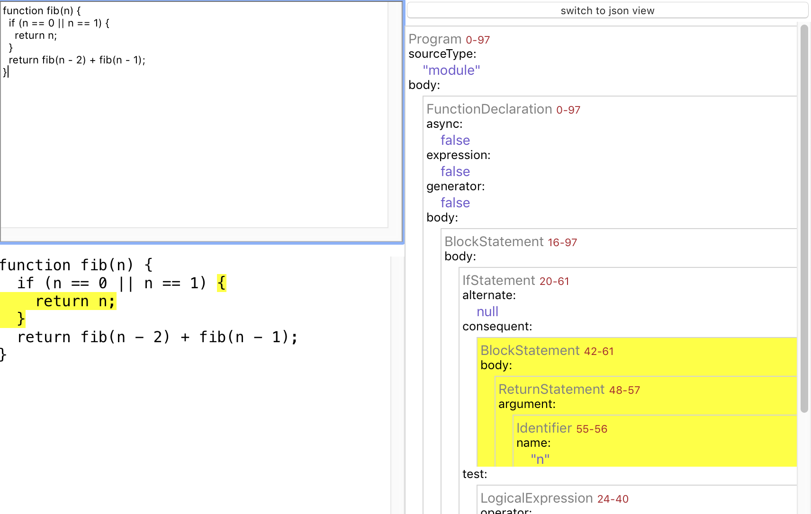
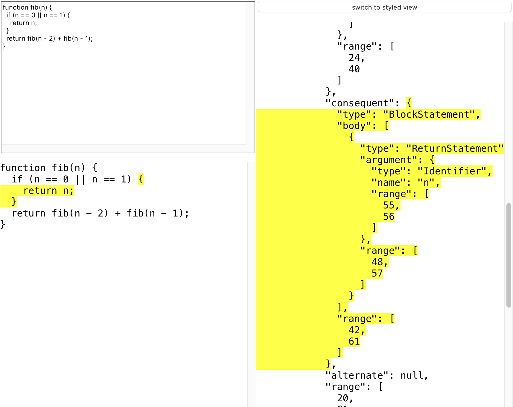

# JS Syntax Tree Explorer

Deployed here: https://brokensandals.github.io/js-syntaxtree-explorer/

This tool allows you to enter a piece of javascript source code and see it displayed side-by-side with a representation of its abstract syntax tree.
Hovering over part of the tree will highlight the relevant part of code, and vice versa.

The code is parsed into a tree using the [esprima](https://esprima.org) library, so this tool can be used for understanding what the data structure produced by that library will look like for a given piece of code.
You can display the tree in a styled format or as JSON.

## Development

Typical development processes for a [create-react-app](https://create-react-app.dev) app should be applicable.

To start the local server, use `npm start`.

To run tests, use `npm test`.

## Contributing

Bug reports and pull requests are welcome on GitHub at https://github.com/brokensandals/js-syntaxtree-explorer.

## License

This is available as open source under the terms of the [MIT License](https://opensource.org/licenses/MIT).
